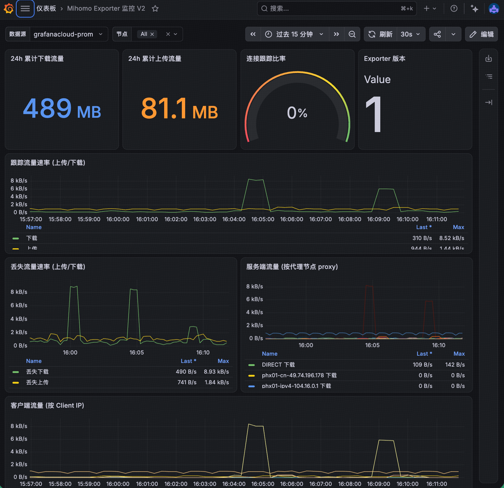

# Grafana 面板

[mihomo-exporter.json](mihomo-exporter.json) 基于用户提供的「Mihomo Exporter 监控 V2」导出文件整理，保留原有 10 个面板、布局和 PromQL 查询。

## 导入

1. 确认 Prometheus 已采集 exporter 的 `/metrics`，并在 Grafana 中配置对应的 Prometheus 数据源。
2. 在 Grafana 的 Dashboards → Import 中上传 `mihomo-exporter.json`。
3. 打开面板，在顶部「数据源」中选择采集了 exporter 指标的 Prometheus，再选择「节点」；节点默认选择全部。
4. 保存面板，可将当前数据源选择保存在自己的 Grafana 实例中。

模板保留原始 `dashboard.grafana.app/v2` 资源格式，原文件导出自 Grafana 13.2.2。请使用支持该 V2 格式的 Grafana 导入；它不是旧版 classic dashboard JSON，旧版本兼容性未验证。

## 面板预览

以下截图由用户提供，展示原面板的实际运行效果。截图中的数据源名称、节点和数值仅为示例；导入模板后请选择自己的 Prometheus。



## 数据源选择

保留 `DatasourceVariable`，限定插件类型为 `prometheus`，并在打开面板时刷新可选数据源。模板的 `current` 使用 V2 schema 的空默认值：

```json
{
  "text": "",
  "value": ""
}
```

这表示模板不预选某个实例的数据源 UID，**不表示强制使用 Grafana 的全局默认数据源**。导入后请确认下拉框选中了正确的 Prometheus；有多个数据源时尤其需要检查。

所有 Prometheus 面板查询及节点变量查询均使用 `${datasource}`，包括原文件中直接绑定 Cloud 数据源 UID 的 Client 面板。内置注释继续使用 `-- Grafana --`，不需要改为 Prometheus。

模板还移除了原实例的 UID、namespace、resourceVersion、创建者、时间戳及内部 ID。资源名称设为 `mihomo-exporter`；若需要保存多份独立面板，请为副本使用不同的资源名称。

## 指标口径

- 24 小时累计流量、流量速率和每日流量使用 `mihomo_exporter_tracked_*`，表示连接快照捕获的流量，不等于 Mihomo 的全局流量。
- Proxy 和 Client 面板分别按 `proxy`、`client` 聚合；选择多个节点时，相同标签的值会合并。
- 节点列表来自 `mihomo_exporter_build_info` 的 `instance` 标签。
- 面板默认每 30 秒刷新；这不会修改 exporter 的采集间隔或 Prometheus 的 scrape 间隔。
- 新部署时 24 小时和每日统计受已有数据范围影响，不会补齐采集前的历史记录。

模板已做 JSON、数据源引用和布局引用检查；尚未在实际 Grafana 实例中导入验证。
